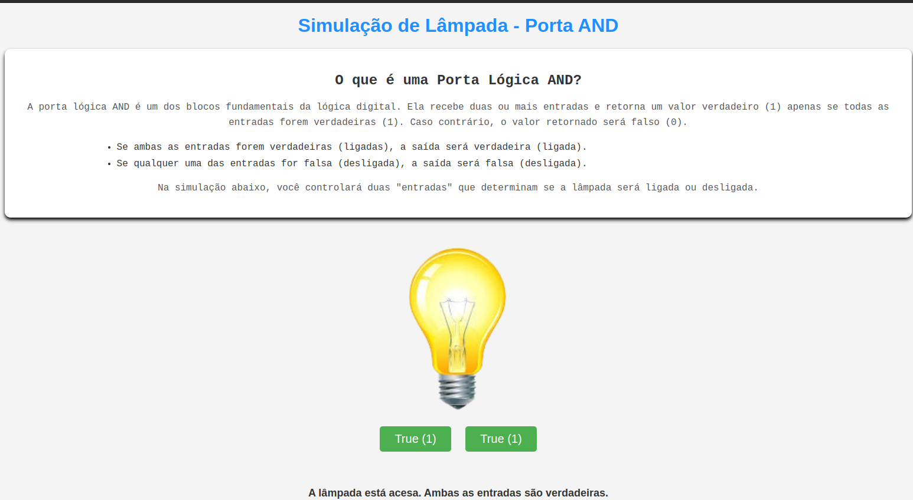

# Simulador de Lâmpada - Porta Lógica AND

Este projeto foi desenvolvido como uma simulação interativa para demonstrar o funcionamento de uma **porta lógica AND**. A simulação mostra como uma lâmpada pode ser controlada com base em duas entradas lógicas, onde a lâmpada só acende quando ambas as entradas estão ativadas.

O objetivo deste projeto é ajudar a visualizar o comportamento da **porta AND** e foi criado como parte da disciplina **Organização e Arquitetura de Computadores**, para demonstrar de forma prática os conceitos da lógica digital.

## Tecnologias Usadas

- **HTML**: Para estruturação do conteúdo e da interface.
- **CSS**: Para estilização e design da página.
- **JavaScript**: Para a lógica interativa de controle da lâmpada com base nas entradas.

## Como Funciona

- A lâmpada será **ligada** apenas quando **ambas as entradas (botões) estiverem ativadas**.
- Se qualquer uma das entradas for **desligada**, a lâmpada permanecerá **desligada**.
- O usuário pode interagir com os botões para ativar ou desativar as entradas e ver a simulação em tempo real.

## Como Rodar

1. Clone o repositório em sua máquina local:

   ```bash
   git clone https://github.com/username/repository-name.git

## Visualização
clique aqui:https://maurosantosif.github.io/L-mpada-AND-Simulator/

